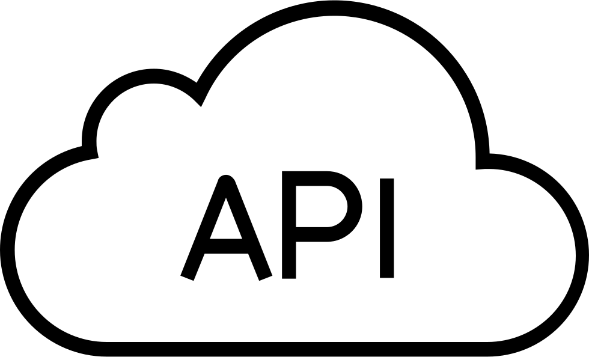

# <!--fit--> Getting Started with JAMStack

Understand why it exists and how to get started

---

# WHO AM I?
- I'm Mehdi Hamime
- I work as a Full Stack developer @Deloitte
- I'm a JavaScript & Open Source enthousiaste

---
# What is 

---
**JAM stands for JavaScript, API & Markup**

>A modern web development architecture based on client-side JavaScript, reusable APIs, and prebuilt Markup
Mathias Biilmann (CEO & Co-founder of Netlify).

---

---

## **JavaScript**

 Dynamic functionalities are handled by JavaScript. There is no restriction on which framework or library you must use.

---

## **APIs**

 Server side operations are abstracted into reusable APIs and accessed over HTTPS with JavaScript. These can be third party services or your custom function.

---

## **Markup**

Websites are served as static HTML files. These can be generated from source files, such as Markdown, using a Static Site Generator.

---

#### BENEFITS

##### 👉 Faster performance : 
- Serve pre-built markup and assets over a CDN

##### 👉 More secure : 
- No need to worry about server or database vulnerabilities
  
##### 👉 Less expensive : 
- Hosting of static files are cheap or even free

---

#### BENEFITS

##### 👉 Better developer experience : 
- Front end developers can focus on the front end, without being tied to a monolithic architecture. This usually means quicker and more focused development

##### 👉 Scalability : 
- If your product suddenly goes viral and has many active users, the CDN seamlessly compensates

--- 

#### BEST PRACTICES

##### 👉 Content delivery network : 
- Since all the markup and assets are pre-built, they can be served via CDN. This provides better performance and easier scalability.

##### 👉 Atomic deploys : 
- Each deploy is a full snapshot of the site. This helps guarantee a consistent version of the site globally.

--- 

#### BEST PRACTICES

##### 👉 Cache invalidation : 
- Once your build is uploaded, the CDN invalidates its cache. This means that your new build is live in an instant.

##### 👉 Everything in version control : 
- Your codebase lives in Version Control System, such as Git. The main benefits are: change history of every file, collaborators and traceability.

--- 

#### BEST PRACTICES

##### 👉 Automated builds : 
- Your server is notified when a new build is required, typically via webhooks. Server builds the project, updates the CDNs and the site is live.

--- 

## **[ZEIT Now](https://zeit.co/now)**

#### Ready to write & host your deck!

---

### <!--fit--> :ok_hand:

